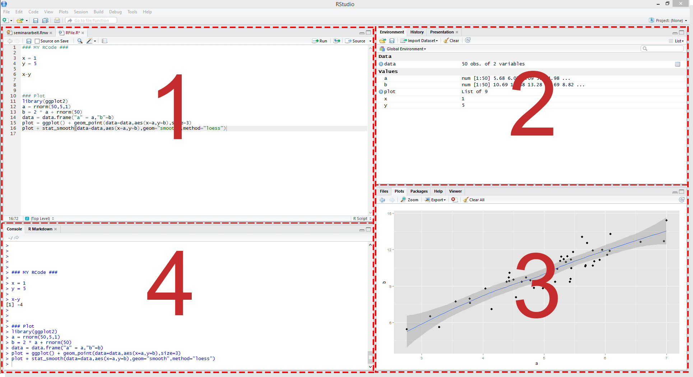

```{r setup, include=FALSE}
knitr::opts_chunk$set(echo = TRUE, warning = FALSE, message = FALSE)
```

<!--Include script for hiding output chunks-->
<script src="js/hideOutput.js"></script>

# Introduction


# Chapter 1: Prerequisites

In order to reproduce the examples in this script You need the statistical software package R. Additionally we recommend using the R editor software RStudio which will improve Your R working experience.

### Installation of R and RStudio

Go to the following webpages and download the software adequate for Your operating system:


  1. <b>The Statistical Software Package R:</b> <a href="http://cran.r-project.org/">http://cran.r-project.org</a><br>
    <br>
  2. <b>The GUI RStudio</b>: <a href="http://www.rstudio.com/products/rstudio/download/">http://www.rstudio.com/products/rstudio/download/</a> <br>


Install R first and then procede with RStudio. Afterwards start RStudio.

### Working with RStudio 

<div class="imgContainer" cap="Fig. 1: Test">
  
</div>

As You can seen from Figure 1, the interface of R-Studio can be roughly broken down to 4 panes.

<b><font color="darkred">1</font></b> is Your script pane. You can think of it as a notepad for Your code. You can also execute code directly from here by marking lines with the cursor and hit the "Run" button. When You open multiple scripts, the script pane basically works like a browser: each script is loaded in its own tab and You can switch between them.

<b><font color="darkred">2</font></b> is the environment pane. All functions and objects that are available at the user level are displayed here. This includes also data sets from external sources. More on that later.

<b><font color="darkred">3</font></b> contains several tabs providing different functionalities e.g. file and package browsers as well as a glossary. Graphical output You create will also be displayed here.

<b><font color="darkred">4</font></b> is the core pane of any R developer environment: The R console. It works like a command line tool. Code that is entered here will be immediately executed when You hit the "enter" key on Your keyboard. The output produced by Your code will (in most cases) also be displayed here.


# Chapter 2 
## Section 2.1

Since chapter reviews basic concepts of probability theory and how they can be applied in R. 

The most common probability distributions are implemented in base R. That means that You can draw random numbers from these distributions, compute densities, probabilies or quantiles. ...

Ein paar Beispiele dazu? Und Chapter 1 könnte dann eine Anleitung zur Installation von R, Rstudio und eine kleine Einführung sein (<- Operator, Funktionen, ...)

# Chapter 3

```{r child = 'chap3.Rmd', eval = TRUE}
```

# Chapter 4

```{r child = 'chap4.Rmd', eval = TRUE}
```

# Chapter 5

```{r child = 'chap5.Rmd', eval = TRUE}
```

# Chapter 6

```{r child = 'chap6.Rmd', eval = TRUE}
```

# Chapter 7

```{r child = 'chap7.Rmd', eval = TRUE}
```

# Chapter 8 Nonlinear Regression Functions

```{r child = 'chap8.Rmd', eval = TRUE}
```


# About Urfite

Lorem ipsum dolor sit amet, consetetur sadipscing elitr, sed diam nonumy eirmod tempor invidunt ut labore et dolore magna aliquyam erat, sed diam voluptua. At vero eos et accusam et justo duo dolores et ea rebum. Stet clita kasd gubergren, no sea takimata sanctus est Lorem ipsum dolor sit amet. Lorem ipsum dolor sit amet, consetetur sadipscing elitr, sed diam nonumy eirmod tempor invidunt ut labore et dolore magna aliquyam erat, sed diam voluptua. At vero eos et accusam et justo duo dolores et ea rebum. Stet clita kasd gubergren, no sea takimata sanctus est Lorem ipsum dolor sit amet.


